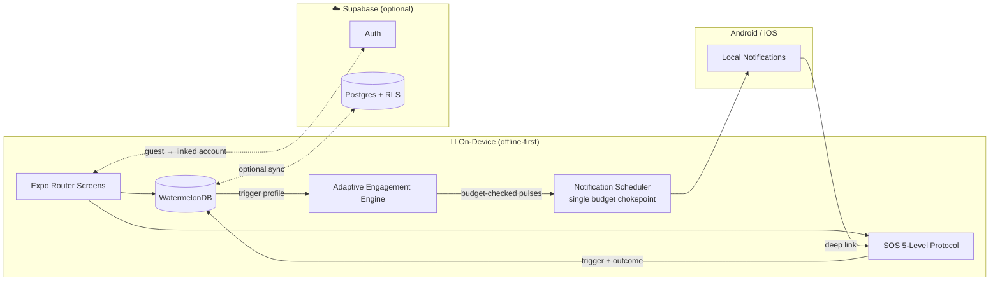

# Quit — A Guided, Real-Time Recovery Companion for Quitting Smoking

**A mobile product that treats a craving as a solvable, 3-minute event — not a test of willpower.**

Built solo, end-to-end: product definition (PRD, personas, KPIs), UX/interaction design, and a production-grade React Native / offline-first architecture.

*Replace with a hero screenshot or GIF of the dashboard once available.*

---

## Table of Contents

1. [Product Overview & Problem Statement](#1-product-overview--problem-statement)
2. [Target Audience & Personas](#2-target-audience--personas)
3. [Key Features & Product Highlights](#3-key-features--product-highlights)
4. [Technical Architecture & Product Choices](#4-technical-architecture--product-choices)
5. [Product Metrics & KPIs](#5-product-metrics--kpis)
6. [Future Roadmap](#6-future-roadmap)

---

## 1. Product Overview & Problem Statement

### The Problem

Most quit-smoking attempts fail in the first few weeks — not for lack of motivation, but for lack of *support in the moment it actually matters*. Existing cessation apps are largely static trackers: a day counter, some motivational copy, maybe a chart. They are silent exactly when the user is not — during an acute craving, which typically peaks and passes within minutes if the user can just get through it.

Two structural gaps show up again and again:

- **No real-time intervention.** A craving is a narrow, time-boxed window. An app that only offers passive stats has nothing to say in that window.
- **No physiological transparency.** Users are told "smoking is bad for you" in the abstract, but rarely shown *what is happening inside their own body, right now,* as a direct consequence of the decision they just made.

### The Solution

**Quit** is a B2C companion app that turns smoking cessation into a structured, visual, and *responsive* journey — one that reacts to the user in real time and makes physiological recovery a measurable, visible story rather than a vague promise.

> **Value Proposition:** *"Quit smoking with a personal guide that understands exactly what your body is going through — right now."*

Rather than a single "add willpower" feature, the product is built around three reinforcing product bets:

1. A **5-level, non-punitive craving de-escalation protocol** available in one tap, at any moment.
2. An **adaptive engagement engine** that learns each user's personal relapse-risk pattern and proactively reaches out *before* a craving spirals — instead of waiting for the user to open the app.
3. A **physiologically-grounded recovery visualization** that makes "why keep going" concrete and cumulative, not abstract.

---

## 2. Target Audience & Personas

The product is designed around what a user *needs in a moment of craving*, not just their demographic profile:

| Persona | Age | Profile | Core Driver | What They Need Mid-Craving |
|---|---|---|---|---|
| **The Committed Quitter** | 35–50 | Smoking 15+ years, multiple prior attempts | Health, family, fear of long-term disease | Fast, credible reassurance grounded in real physiology — not generic slogans |
| **The Young Quitter** | 22–34 | Smoking 3–8 years | Money saved, appearance, stamina | Concrete, quantified proof of progress (₪ saved, cigarettes avoided) |
| **The Quitter Under Pressure** | 28–45 | Social / stress smoker | Wants to quit discreetly, without announcing it | A private, judgment-free tool — no forced social sharing, no public accountability |

A recurring, deliberate design principle across every persona: **the app never locks the user in place.** Every intervention screen exposes a visible "skip" action from the first second — a user who already knows what helps them is never held hostage by a script that isn't working for them.

---

## 3. Key Features & Product Highlights

### 🚨 SOS — 5-Level Craving De-escalation Protocol
One prominent, always-accessible button ("I need a cigarette right now") launches a full-screen guided intervention that escalates only as far as the user needs:

1. **Controlled breathing** — animated box-breathing with a visual pacing guide.
2. **Urge surfing** — a 5-step mindfulness sequence that reframes the craving as a wave that peaks and recedes, rather than an enemy to fight.
3. **Distraction + trigger mapping** — a physical action (a walk, ice cubes, gum) paired with an *optional* trigger tag (stress, boredom, alcohol, habit…) that feeds the personalization engine below.
4. **Values & social support** — resurfaces the user's own stated reasons for quitting, plus one-tap paths to message a friend or call a national quitline.
5. **Containment & professional referral** — for sustained struggle (15+ minutes), a screening flow that routes appropriately, including an immediate hard-stop to a crisis line if self-harm risk is detected.

**Product value:** most cessation apps offer one generic "distraction tip." This is a *protocol*, not a tip — it matches intervention intensity to craving intensity, and it is instrumented (every outcome is logged) so the app gets smarter about what works for *this* user.

### 🧠 Adaptive Engagement Engine — the "Relapse Vulnerability Curve"
The most differentiated system in the product. Rather than sending generic reminders, the app models each user's relapse risk as a curve over time and **proactively reaches out before the craving becomes a crisis**:

- **Phase-aware pulsing** — up to 3 check-ins/day in the critical first 14 days, tapering to 1/day through stabilization, down to a **silent-guard maintenance phase** with zero proactive pulses once the user has stabilized.
- **Personal trigger profiling** — a 14-day exponentially-weighted model learns each user's dominant craving triggers (stress, boredom, social exposure…) from both explicit surveys and real SOS sessions, weighting real in-the-moment signals more heavily than self-reported ones.
- **Content that never goes stale** — intervention copy is served from a weighted rotation matrix (never the same block twice in a cycle) so a returning user isn't shown a memorized, ignored message.
- **A hard notification budget** — every proactive touchpoint funnels through one scheduling chokepoint enforcing a strict daily cap and user-defined quiet hours, because notification fatigue is one of the top uninstall drivers in this category.

**Product value:** this turns the app from *reactive* (user must remember to open it) to *anticipatory* (the app shows up right before the user needs it) — while explicitly engineering against the notification fatigue that kills retention in habit-support apps.

### 📊 Real-Time Recovery Dashboard
Live smoke-free counter (down to the minute), cigarettes avoided, and money saved — all computed client-side from a single `quit_date`, so they're correct even after the app has been closed for days.

### 🫀 Interactive Body Recovery Map
An SVG human body model that color-codes organ systems by recovery stage (recovered / actively recovering / future), tied to a horizontal timeline of physiological milestones from 20 minutes to 15 years post-quit — each tap explains, in plain language, what's happening inside the body *right now*.

### 💧 Hydration Tracking + Craving Correlation Analytics
Water intake logging that cross-references against the craving log to surface a genuinely personal insight (e.g., *"On days you drank 6+ cups, you had fewer cravings"*) rather than a generic "drink more water" tip.

### 📝 Daily Check-Ins
A 15-second daily mood check-in that adapts the day's support — a string of difficult check-ins proactively surfaces extra help rather than waiting for the user to ask.

### 💙 Compassionate Relapse Flow
Relapse is treated as data, not failure: the streak resets, but the **personal-best streak is preserved and always visible**, historical badges and check-ins are never deleted, and the user is met with a reframing message instead of a guilt trip — a deliberate retention decision, since shame is a proven app-abandonment trigger.

### 🏆 Milestones & Badges
Achievement markers from 1 hour to 1 year, each paired with a concrete health fact, to create a daily motivation loop beyond the raw day count.

### 🔔 Reliability as a Product Feature
A custom native Expo config plugin requests OS-level battery-optimization exemption so that life-critical craving notifications survive aggressive OEM power management — a real-world device-behavior problem most teams discover only after users complain, addressed here proactively.

### ☁️ Offline-First with Optional Account Sync
The entire core experience — counter, SOS, dashboard, savings — works with zero network connection. An optional account (email, Apple, Google via Supabase Auth) upgrades a local guest profile to cloud-backed sync without any data loss, for users who want a safety net across devices.

---

## 4. Technical Architecture & Product Choices

Every technical choice below was driven by a product requirement, not novelty for its own sake:

| Choice | Product Requirement It Serves |
|---|---|
| **React Native + Expo (Router, Dev Client, CNG)** | Cross-platform velocity for a solo-built product; file-based routing keeps every screen file a thin view, so navigation changes never touch business logic. |
| **WatermelonDB (local-first reactive database)** | The SOS screen must render in **under 1 second with zero network dependency** — a user mid-craving cannot wait on a server round-trip. All core flows are fully functional offline. |
| **Supabase (Postgres + Auth + Row-Level Security)** | Optional cloud backup/sync without building or owning auth infrastructure; RLS enforces per-user data isolation at the database layer. |
| **Zustand** | Minimal, explicit global UI state (in-progress onboarding drafts, ephemeral flow state) — deliberately kept separate from persisted domain data, which lives in WatermelonDB, so "state" and "data" are never conflated. |
| **NativeWind (Tailwind for React Native)** | A single, enforced design-token system (the "Premium Flat" UI standard) across every screen, with RTL-first logical alignment built in from day one for a Hebrew-speaking launch market. |
| **react-native-reanimated + gesture-handler** | Native-thread animation for the breathing guide and body-map interactions — these need to stay smooth precisely when the user is most stressed. |
| **Custom Expo Config Plugins (Continuous Native Generation)** | Solved a native Android permission requirement (battery-optimization exemption) without ejecting from the managed workflow — keeps build velocity while still reaching into native territory when the product genuinely needs it. |
| **Pure-function core for the adaptive engine** (`curve.ts`, `servingPolicy.ts`, `triggerProfile.ts`) with a single scheduling chokepoint (`scheduler.ts`) | This subsystem decides *when to interrupt a recovering user* — a high-stakes, easy-to-get-wrong surface. Isolating it into pure, fully unit-tested functions behind one enforcement point makes the notification budget provably correct, not just "probably fine." |
| **60+ Jest suites** — unit, integration (via an in-memory LokiJS WatermelonDB adapter), and screen-level tests | A user's multi-month streak lives in this database. The test suite exists so that schema and business-logic changes can be made confidently without silently corrupting someone's progress. |

### System Overview

---

## 5. Product Metrics & KPIs

As a pre-launch product, these are the **success metrics the product is designed against** — the North Star targets that shaped feature scope (e.g., they are the direct reason the SOS "skip" button and the notification budget guard exist):

| Metric | 90-Day Target |
|---|---|
| Day 7 Retention | ≥ 40% |
| Day 30 Retention | ≥ 20% |
| Average Daily Opens | ≥ 1.5 |
| Craving-System Engagement (SOS usage among active users) | ≥ 30% |
| Daily Check-In Completion Rate | ≥ 50% |
| App Store Rating | ≥ 4.3 |

---

## 6. Future Roadmap

- **AI-personalized coaching.** The adaptive engine already logs per-user trigger patterns and intervention outcomes — the natural next step is a generative layer that turns that behavioral history into truly personalized, conversational coaching instead of pre-authored content blocks.
- **Peer support / community layer.** Optional, opt-in connection with other users at a similar stage of the journey, without compromising the app's current judgment-free privacy stance.
- **Wearable-driven craving prediction.** Extending the Relapse Vulnerability Curve with real biometric signals (e.g., heart-rate variability from a connected wearable) alongside self-reported data, to detect a craving building *before* the user even reaches for the app.

---

  Solo-built product case study — architecture, product definition, and implementation by the author.

